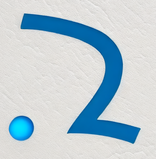

# ZEngine（中文说明）

<p align="center">
  <a href="https://zentia.github.io">
    
  </a>
</p>

**Z Engine** 是一个轻量级游戏引擎。

## 最新更新（2026年2月）

- **性能分析增强**：支持 C#、Lua 和原生代码的内存分析，配备详细 UI
- **脚本支持**：改进 Lua 和 JavaScript/TypeScript 集成（通过 Puerts）
- **编辑器工具**：新增控制台窗口，优化资源管理
- **序列化系统**：完整的二进制序列化系统，支持 TypeTree 反射
- **构建改进**：预编译头文件加速编译

详细版本历史请查看 [CHANGELOG.md](CHANGELOG.md)。

## 核心特性

### 引擎核心
- **多平台支持**：Windows、Linux 和 macOS
- **Vulkan 渲染器**：现代图形 API，支持验证层
- **物理引擎**：集成 Jolt Physics 物理引擎
- **资源管线**：完整的资源管理和打包系统

### 脚本系统
- **Lua 集成**：完整 Lua 脚本支持，带性能分析
- **Puerts 支持**：通过 Puerts 支持 JavaScript/TypeScript
- **C# 脚本**：托管脚本，支持内存分析

### 编辑器
- **可视化编辑器**：基于 ImGui 的编辑器界面
- **控制台窗口**：内置调试控制台
- **项目管理**：资源浏览器和层级视图
- **时间轴编辑器**：动画和序列编辑工具
- **Inspector**：属性编辑和组件管理

### 开发工具
- **性能分析**：支持所有脚本语言的内存和性能分析
- **序列化**：支持反射的二进制和 JSON 序列化
- **虚拟文件系统**：灵活的文件系统抽象
- **热重载**：资源和脚本热重载支持

## 持续集成状态

| 构建类型         | 状态                                                                                   |
| :--------------: | :------------------------------------------------------------------------------------: |
| **Windows 构建** | [](https://github.com/zentia/ZEngine/workflows/build_windows.yml) |
| **Linux 构建**   | [](https://github.com/zentia/ZEngine/actions/workflows/build_linux.yml) |
| **macOS 构建**   | [](https://github.com/zentia/ZEngine/actions/workflows/build_macos.yml) |

## 依赖环境

构建 ZEngine 需要先安装以下工具：

### Windows 10/11
- Visual Studio 2022（或更新版本）
- CMake 3.19（或更新版本）
- Git 2.1（或更新版本）
- Vulkan SDK

### macOS >= 10.15 (x86_64)
- Xcode 12.3（或更新版本）
- CMake 3.19（或更新版本）
- Git 2.1（或更新版本）
- Vulkan SDK

### Ubuntu 20.04
请安装以下依赖包：
```bash
sudo apt install libxrandr-dev libxrender-dev libxinerama-dev libxcursor-dev libxi-dev libglvnd-dev libvulkan-dev cmake clang libc++-dev libglew-dev libglfw3-dev vulkan-validationlayers mesa-vulkan-drivers
```
- [NVIDIA 驱动](https://docs.nvidia.com/cuda/cuda-installation-guide-linux/index.html#runfile)（AMD/Intel 驱动已由 mesa-vulkan-drivers 自动安装）

## 构建指南

### Windows 构建
直接运行 **build_windows.bat**，会自动生成工程并编译 Release 配置，生成的 ZEditor.exe 位于 **bin** 目录。

也可以手动生成 Visual Studio 工程：
```powershell
cmake -S . -B build
```
然后用 Visual Studio 打开 build 目录下的解决方案进行编译。

### macOS 构建
> 仅支持 x86_64，M1 芯片支持后续发布。

确保已安装最新版 Xcode，然后在项目根目录运行：
```bash
cmake -S . -B build -G "Xcode"
cmake --build build --config Release
```
或直接执行 **build_macos.sh**。

### Ubuntu 构建
执行 **build_linux.sh** 即可自动编译。

## 文档
详细文档请参见 Wiki。

## 常见问题

### Vulkan Validation Layer 报错
如遇到 Vulkan Validation Layer: Validation Error，请安装最新版 Vulkan SDK。

### 生成编译数据库
如需生成 `compile_commands.json`（供 clangd 等工具使用）：
```powershell
cmake -DCMAKE_TRY_COMPILE_TARGET_TYPE="STATIC_LIBRARY" -DCMAKE_EXPORT_COMPILE_COMMANDS=ON -S . -B compile_db_temp -G "Unix Makefiles"
copy compile_db_temp\compile_commands.json .
```

### 启用物理调试渲染器
仅支持 Windows，生成带调试器的解决方案：
```powershell
cmake -S . -B build -DENABLE_PHYSICS_DEBUG_RENDERER=ON
```
注意：
1. 重新生成前请清理 build 目录，避免 CMakeCache 导致的问题。
2. 启动 ZEditor 后物理调试渲染器会自动运行，初始相机模式可能不正确，滚动鼠标滚轮可切换到正确模式。

## 代码风格规范

### C++ 命名规范

- **命名空间**：首字母大写，简短（如 `namespace Z`）
- **类名**：PascalCase（如 `MemoryManager`、`RuntimeGlobalContext`）
- **函数名**：camelCase，动词开头（如 `initialize()`、`createObject()`）
- **成员变量**：`m_` 前缀 + camelCase（如 `m_windowSystem`）
- **静态成员**：`s_` 前缀 + camelCase（如 `s_instance`）
- **常量**：全大写+下划线（如 `MAX_BUFFER_SIZE`）
- **枚举类型**：类型 PascalCase，枚举值全大写（如 `FORWARD`、`DEFERRED`）
- **参数/局部变量**：camelCase（如 `deltaTime`、`frameCount`）
- **接口类**：`I` 前缀 + PascalCase（如 `IRenderer`）
- **文件名**：小写+下划线，头文件 `.h`，源文件 `.cpp`（如 `memory_manager.h`）
- **宏定义**：全大写+下划线，项目相关加前缀（如 `Z_ASSERT`）
- **模板参数**：大写字母或 PascalCase（如 `T`、`KeyType`）
- **布尔变量**：is/has/can/should 前缀（如 `isVisible`）
- **私有方法**：可用下划线后缀（如 `calculateBounds_`）

#### 总体原则
1. 保持风格一致
2. 新代码遵循现有规范
3. 重大重构时统一命名
4. 以可读性和清晰性为首要

---

如需补充更多内容或有其他问题，欢迎提交 Issue 或 PR！
