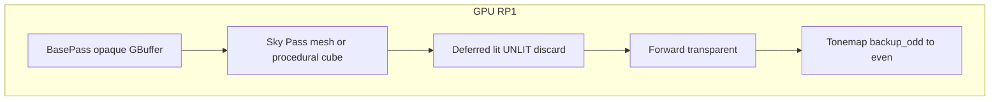

# DX12 Skybox / IBL Rendering (ZEngine Editor)

Read this doc before debugging Scene-view sky or touching:

- `MainCameraRp1Pass`, `sky_mesh.vert.hlsl`, `sky_procedural.vert.hlsl`, `deferred_lighting.frag.hlsl`
- `DX12MainCameraPass`, `BindlessTonemapPass`, `MainCameraRp2Pass`, IBL upload in `RenderResourceDx12.cpp`

UE reference (read-only): `../UnrealEngine/Engine/Source/Runtime/Renderer/Private/SkyPassRendering.cpp`.

---

## 1. Architecture summary (Plan C: UE Mesh SkyPass)

**Active sky path:** RP1 **deferred subpass** runs **Sky Pass** after `backup_odd` clear and **before** deferred lighting.

| Source | Draw | Output |
|--------|------|--------|
| Scene entity with **IsSky** material (`LightMode=Sky`, shader `Sky`, or `RenderPipeline=Sky`) | `sky_mesh.vert` + `sky_mesh.frag` mesh draw | HDR `backup_odd` |
| No scene sky mesh + skybox toggle on | Procedural sky cube (`sky_procedural.vert`, 36 verts) | HDR `backup_odd` |

Sky materials are **excluded from BasePass** gbuffer (`RenderScene::GetMainCameraSkyMeshNodes`). Deferred lighting **discards UNLIT** pixels so lit shading does not overwrite sky HDR.

**Vulkan:** same pass **timing** (Sky Pass before deferred in `MainCameraPass`); procedural `skybox.vert/frag` only. Scene `LightMode=Sky` mesh draw on Vulkan is not wired yet (DX12 only).

---

## 2. Frame timeline (DX12)

### IsSky material contract

Detect via `MainCameraPassShaderCommon::IsSkyMaterial`:

- `shader_name == "Sky"` (case-insensitive), or
- `light_mode == "Sky"`, or
- `render_pipeline == "Sky"`, or
- any shader pass with `light_mode == "Sky"`

Assign on project materials through ShaderLab `Tags { "LightMode" = "Sky" }` or built-in shader name `Sky`.

**Demo reference (ZEngineDemo):**

| Asset | Path |
|-------|------|
| Sky dome mesh | `Assets/SkyDome.obj` (unit sphere; scale on Transform) |
| Sky material | `Assets/Sky.mat` (`shader: Sky`, `is_double_sided: true`) |
| Shader source | `Shaders/Sky.shader` (`LightMode = "Sky"`) |
| Scene instance | `Assets/asset/level/1-1.scene` GameObject `SkyDome` |

### Shaders

| File | Role |
|------|------|
| `sky_procedural.vert.hlsl` | Procedural cube at camera (Vulkan `skybox.vert` port) |
| `sky_mesh.vert.hlsl` | Scene sky-dome mesh; far-depth clamp `z = w * 0.99999` |
| `sky_mesh.frag.hlsl` | Sample IBL specular cubemap (`t5`) into HDR |

### Dead paths

| Symbol | Why dead |
|--------|----------|
| `DrawSkyboxInRp1Forward` / `skybox_forward.frag.hlsl` | Replaced by Plan C mesh SkyPass |
| Deferred UNLIT cubemap (HLSL/GLSL) | UNLIT always `discard` |
| `DrawEditorSkyboxOverlays` | No call sites |

---

## 3. RenderDoc checklist

| # | When | Expect |
|---|------|--------|
| 1 | After BasePass | Sky pixels: gbuffer cleared, depth 1.0 |
| 2 | After subpass transition | `backup_odd` = clear `(0.29, 0.345, 0.435)` |
| 3 | After **Sky Pass** | HDR cubemap in scene rect |
| 4 | After Deferred | UNLIT pixels unchanged vs step 3 |
| 5 | After tonemap | `backup_even` LDR with sky detail |

Event marker: **`Sky Pass`** (between BasePass and Deferred Lighting).

---

## 4. UE comparison

UE `EMeshPass::SkyPass`: opaque base pass -> **SkyPass** (SceneColor only, no GBuffer) -> deferred lights.

ZEngine Plan C mirrors **timing** and **no-gbuffer sky** using:

- Engine procedural cube (IBL fallback), or
- Scene mesh with IsSky material

Not yet implemented: UE `Material::IsSky()` reflection flag as a dedicated inspector toggle (use `LightMode=Sky` today), atmosphere pass, mesh pass processor abstraction.

---

## 5. Code verification log

| Check | Evidence |
|-------|----------|
| Sky routing | `RenderScene.cpp` `IsSkyMaterial` -> `m_MainCameraSkyMeshNodesPerViewport` |
| Sky Pass timing | `MainCameraRp1Pass::DrawRP1` after first `CmdNextSubpass` |
| Procedural fallback | `DrawSkyMeshPass` -> `CmdDraw(36)` when sky node list empty |
| Scene mesh sky | `DrawSkyMeshPass` -> `_render_pipeline_type_sky_mesh` |
| Deferred discard | `deferred_lighting.frag.hlsl`, `deferred_lighting.frag` |
| Vulkan timing | `MainCameraPass.cpp` Sky Pass before deferred; skybox PSO subpass = deferred |

---

## 6. Future work

- Vulkan scene mesh SkyPass (parity with DX12 `sky_mesh` pipeline)
- `Material.m_IsSky` serialized toggle + inspector
- Late atmosphere pass (UE `RenderSkyAtmosphere`)
- Per-material cubemap override in sky fragment (today: global IBL specular only)
